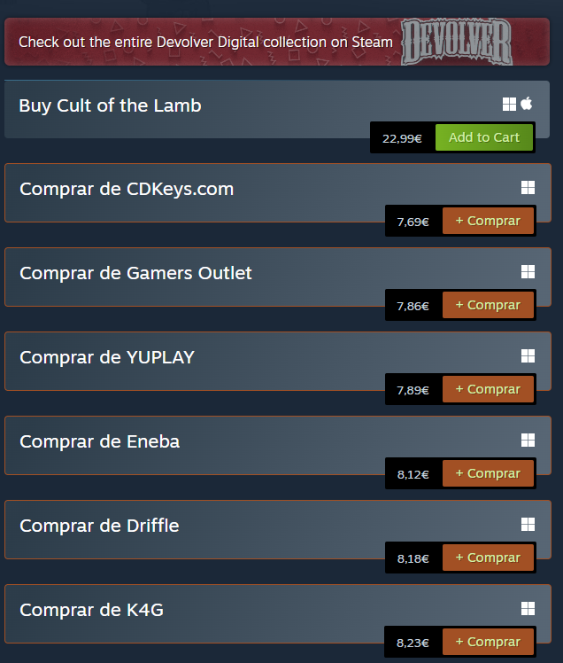
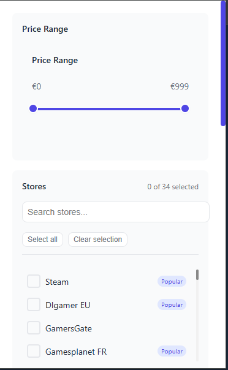
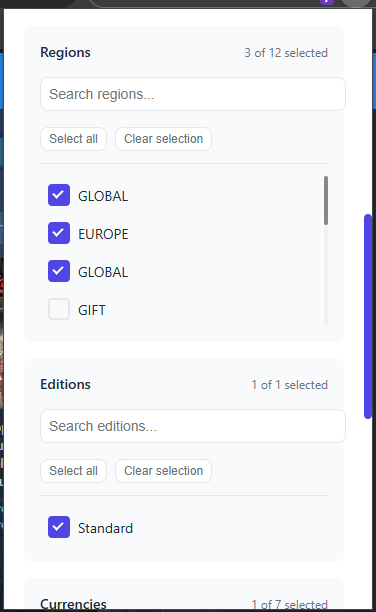
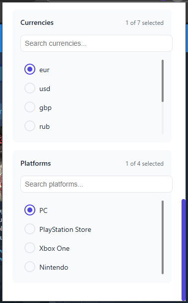

# Steam Price Extension

This extension provides up-to-date price information for games on the Steam platform.

## Features

- Fetches the latest prices for Steam games.

## Installation

1. Clone the repository:
    ```sh
    git clone https://github.com/marcelordias/steam-price-extension.git
    ```

## Usage

1. Open your browser and navigate to the extensions page.
2. Load the unpacked extension from the project directory (cd cd steam-price-extension/prices_extensions).
3. Use the extension to browse Steam and get the latest prices.

## Screenshots

Here are some screenshots demonstrating the extension in action:

### Example 1: Game Page with Price Information


### Example 2: Extension in Action




## Contributing

Contributions are welcome! Please fork the repository and submit a pull request.

## Contact

If you have any questions or feedback, feel free to contact me.